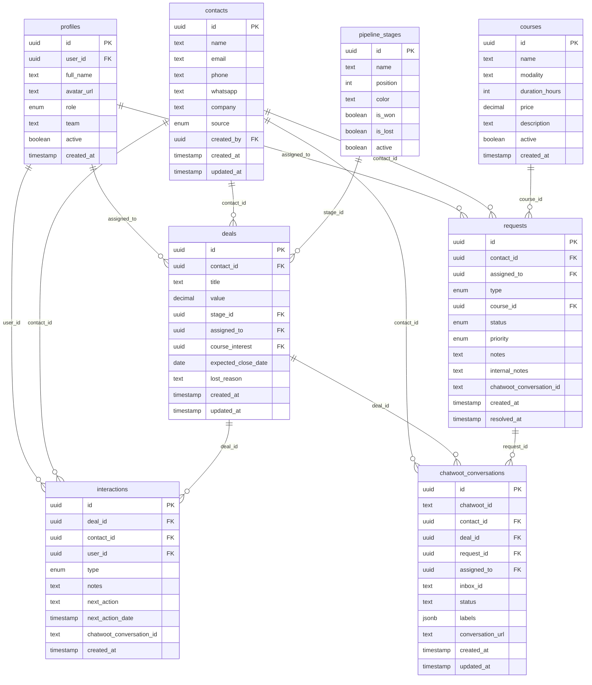
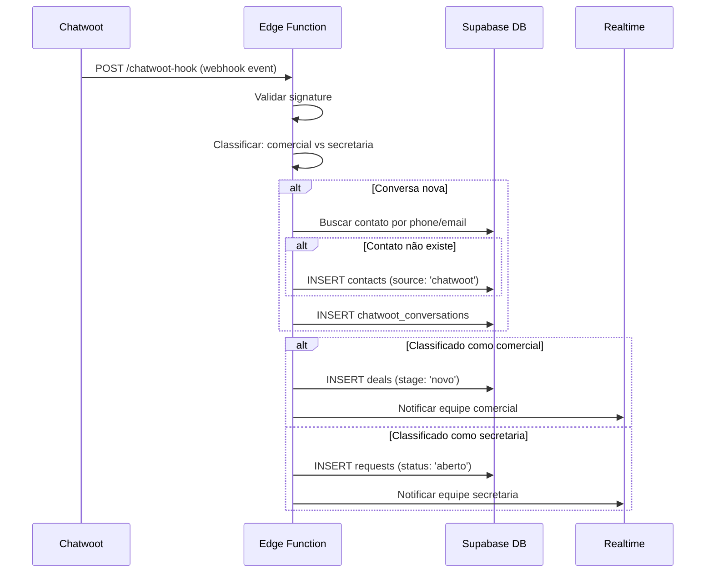

# Arquitetura Técnica — Sistema de Atendimento Comercial

> **Versão:** 1.0  
> **Autor:** Architect Agent (BMAD-Method)  
> **Data:** 2026-04-17  
> **Referência:** PRD v1.0

---

## 1. Visão Geral da Arquitetura

```
┌─────────────────────────────────────────────────────────────────┐
│                         FRONTEND                                 │
│                    Next.js 15 (App Router)                       │
│            TypeScript + Tailwind CSS v4 + Zustand                │
│                     Deploy: Vercel                               │
├─────────────────────────────────────────────────────────────────┤
│                                                                  │
│   ┌─────────────┐  ┌──────────────┐  ┌────────────────────┐    │
│   │  Auth Pages  │  │  Dashboard   │  │  CRM / Pipeline    │    │
│   │  (Login)     │  │  (KPIs)      │  │  (Kanban)          │    │
│   └─────────────┘  └──────────────┘  └────────────────────┘    │
│                                                                  │
│   ┌─────────────┐  ┌──────────────┐  ┌────────────────────┐    │
│   │  Contatos    │  │  Inbox       │  │  Secretaria        │    │
│   │  (CRUD)      │  │  (Chatwoot)  │  │  (Solicitações)    │    │
│   └─────────────┘  └──────────────┘  └────────────────────┘    │
│                                                                  │
├─────────────────────────────────────────────────────────────────┤
│                        BACKEND                                   │
│                    Supabase Platform                              │
│                                                                  │
│   ┌──────────┐  ┌──────────┐  ┌──────────┐  ┌──────────────┐  │
│   │ Auth     │  │ Database │  │ Realtime │  │ Edge         │  │
│   │ (JWT)    │  │ (PgSQL)  │  │ (WS)     │  │ Functions    │  │
│   └──────────┘  └──────────┘  └──────────┘  └──────────────┘  │
│                                                                  │
├─────────────────────────────────────────────────────────────────┤
│                     INTEGRAÇÃO                                   │
│                                                                  │
│   ┌──────────────────────────────────────────────────────────┐  │
│   │  Chatwoot  ←──  Webhooks  ──→  Edge Function (router)   │  │
│   │            ←──  REST API  ──→  Next.js API Routes       │  │
│   └──────────────────────────────────────────────────────────┘  │
│                                                                  │
└─────────────────────────────────────────────────────────────────┘
```

---

## 2. Stack Técnica

| Camada | Tecnologia | Versão | Justificativa |
|--------|------------|--------|---------------|
| Frontend | Next.js | 15.x | App Router, SSR, API Routes integradas |
| Linguagem | TypeScript | 5.x | Type safety, IntelliSense |
| Styling | Tailwind CSS | v4 | Utility-first, design tokens |
| State | Zustand | 5.x | Leve, sem boilerplate |
| Data fetching | TanStack Query | 5.x | Cache, invalidation, optimistic updates |
| Drag & Drop | @dnd-kit | 6.x | Kanban acessível |
| Charts | Recharts | 2.x | React nativo, flexível |
| Backend | Supabase | latest | Auth + DB + Realtime + Edge Functions |
| Database | PostgreSQL | 15 | Via Supabase managed |
| Deploy FE | Vercel | — | Zero config com Next.js |
| Integração | Chatwoot | API v1 | REST + Webhooks |

---

## 3. Modelo de Dados

### 3.1 Diagrama ER



### 3.2 Enums

```sql
-- Roles do sistema
CREATE TYPE user_role AS ENUM (
  'admin', 'gestor_comercial', 'vendedor', 'coordenador', 'atendente_secretaria'
);

-- Origem do contato
CREATE TYPE contact_source AS ENUM (
  'chatwoot', 'manual', 'formulario', 'indicacao', 'site', 'outro'
);

-- Tipo de interação
CREATE TYPE interaction_type AS ENUM (
  'ligacao', 'whatsapp', 'email', 'reuniao', 'visita', 'outro'
);

-- Tipo de solicitação da secretaria
CREATE TYPE request_type AS ENUM (
  'info_curso', 'matricula', 'financeiro', 'documentacao', 'outro'
);

-- Status da solicitação
CREATE TYPE request_status AS ENUM (
  'aberto', 'em_andamento', 'aguardando_cliente', 'resolvido', 'cancelado'
);

-- Prioridade
CREATE TYPE request_priority AS ENUM (
  'baixa', 'normal', 'alta', 'urgente'
);
```

---

## 4. Políticas de Segurança (RLS)

### Princípios

1. **Admin** — acesso total a tudo
2. **Gestor Comercial** — acesso total ao CRM, visualização de solicitações
3. **Vendedor** — apenas seus próprios deals, contatos que criou/foram atribuídos
4. **Coordenador** — visualização do CRM, acesso total às solicitações
5. **Atendente Secretaria** — sem CRM, apenas solicitações atribuídas

### Políticas SQL (exemplos-chave)

```sql
-- Contatos: vendedor vê apenas os que criou ou onde tem deal
CREATE POLICY "vendedor_contacts" ON contacts
  FOR SELECT TO authenticated
  USING (
    get_user_role(auth.uid()) IN ('admin', 'gestor_comercial', 'coordenador')
    OR created_by = auth.uid()
    OR id IN (SELECT contact_id FROM deals WHERE assigned_to = auth.uid())
  );

-- Deals: vendedor vê apenas os atribuídos a ele
CREATE POLICY "vendedor_deals" ON deals
  FOR SELECT TO authenticated
  USING (
    get_user_role(auth.uid()) IN ('admin', 'gestor_comercial', 'coordenador')
    OR assigned_to = auth.uid()
  );

-- Requests: atendente vê apenas as atribuídas
CREATE POLICY "atendente_requests" ON requests
  FOR SELECT TO authenticated
  USING (
    get_user_role(auth.uid()) IN ('admin', 'coordenador')
    OR assigned_to = auth.uid()
  );
```

---

## 5. Integração Chatwoot

### 5.1 Fluxo de Webhook



### 5.2 Classificação Automática

```typescript
function classifyConversation(event: ChatwootEvent): 'comercial' | 'secretaria' {
  const labels = event.conversation?.labels || [];
  const inboxName = event.inbox?.name?.toLowerCase() || '';

  // Regra 1: labels explícitos
  if (labels.includes('comercial') || labels.includes('venda')) return 'comercial';
  if (labels.includes('secretaria') || labels.includes('matricula')) return 'secretaria';

  // Regra 2: inbox configurado
  if (inboxName.includes('comercial') || inboxName.includes('vendas')) return 'comercial';
  if (inboxName.includes('secretaria') || inboxName.includes('curso')) return 'secretaria';

  // Default: comercial (lead potencial)
  return 'comercial';
}
```

---

## 6. Rotas da Aplicação

| Rota | Componente | Roles permitidos |
|------|-----------|------------------|
| `/login` | LoginPage | Público |
| `/` | Dashboard | Todos autenticados |
| `/pipeline` | KanbanBoard | admin, gestor, vendedor |
| `/leads` | ContactList | admin, gestor, vendedor, coordenador |
| `/leads/[id]` | ContactDetail | admin, gestor, vendedor, coordenador |
| `/inbox` | InboxView | Todos autenticados |
| `/secretaria` | RequestQueue | admin, coordenador, atendente |
| `/secretaria/[id]` | RequestDetail | admin, coordenador, atendente |
| `/relatorios` | Reports | admin, gestor, coordenador |
| `/configuracoes` | Settings | admin |
| `/configuracoes/usuarios` | UserManagement | admin |
| `/configuracoes/pipeline` | PipelineConfig | admin |
| `/configuracoes/cursos` | CourseManagement | admin, coordenador |

---

## 7. ADRs (Architecture Decision Records)

### ADR-001: CRM próprio vs. terceiro

| | |
|---|---|
| **Status** | Aceito |
| **Contexto** | Precisamos de CRM integrado com secretaria e Chatwoot |
| **Decisão** | CRM próprio com Supabase |
| **Consequências** | (+) Integração nativa com módulo de secretaria, (-) Mais código para manter |

### ADR-002: Supabase como backend

| | |
|---|---|
| **Status** | Aceito |
| **Contexto** | Equipe já usa Supabase em outros projetos |
| **Decisão** | Supabase para Auth, DB, Realtime e Edge Functions |
| **Consequências** | (+) Consistência no ecossistema, (-) Vendor lock-in |

### ADR-003: Chatwoot como proxy, não embed

| | |
|---|---|
| **Status** | Aceito |
| **Contexto** | Chatwoot já gerencia WhatsApp e canais de mensagem |
| **Decisão** | Integrar via API/webhooks, não replicar mensagens no DB |
| **Consequências** | (+) Não duplica dados, (-) Depende da disponibilidade do Chatwoot |

### ADR-004: Tailwind CSS v4 para styling

| | |
|---|---|
| **Status** | Aceito |
| **Contexto** | Produtividade e consistência visual |
| **Decisão** | Tailwind v4 com design tokens customizados |
| **Consequências** | (+) Rápido de estilizar, (+) Responsivo nativo |

### ADR-005: @dnd-kit para Kanban

| | |
|---|---|
| **Status** | Aceito |
| **Contexto** | Kanban com drag-and-drop acessível |
| **Decisão** | @dnd-kit em vez de react-beautiful-dnd (deprecated) |
| **Consequências** | (+) Suporte ativo, acessível, (-) API mais verbosa |
